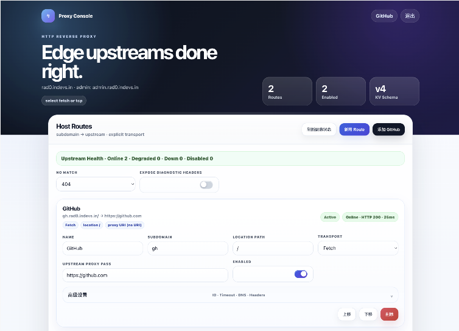

# Cloudflare Worker Proxy Pro

Cloudflare Worker Proxy Pro 是一个运行在 **Cloudflare Workers + KV** 上的 Host-based 反向代理控制台。每个子域名对应一条虚拟主机规则，Worker 根据请求 Host 匹配上游；标准 HTTP/HTTPS 端口使用 Worker `fetch()`，需要非标准端口或特殊 TCP 场景时使用 TCP Sockets。



## 产品能力

- Host-based routing：按子域名匹配代理规则
- Admin console：`admin.<MAIN_DOMAIN>` 独立后台入口
- Hybrid upstream：标准 HTTP/HTTPS 使用 `fetch()`，特殊场景使用 `cloudflare:sockets`
- DNS resolve：域名上游可通过 `node:dns` 的 `resolve4/resolve6` 解析后连接
- IP origin：支持直接代理到 IP 源站
- Header policy：支持请求头转发、删除、覆盖；`Host` 可通过 `headers.set` 定义
- Upstream health：后台显示每条规则的上游响应状态、HTTP 状态码与延迟
- KV storage：代理规则保存到 Cloudflare KV

## 域名模型

以 `MAIN_DOMAIN=rad0.indevs.in` 为例：

| 域名 | 作用 |
|---|---|
| `admin.rad0.indevs.in` | 后台控制台 |
| `proxy.rad0.indevs.in` | 产品落地页 |
| `gh.rad0.indevs.in` | 代理到 GitHub 上游 |

运行时分流：

```text
admin.<MAIN_DOMAIN>  -> 后台控制台
proxy.<MAIN_DOMAIN>  -> 产品落地页
<sub>.<MAIN_DOMAIN>  -> Host Route 代理
其他 Host            -> 404 Not Managed
```

## 产品概览

Cloudflare Worker Proxy Pro 提供一个运行在 Cloudflare Edge 上的多租户反向代理控制台。核心思路是：一个 Worker 管理多个子域名，每个子域名在后台对应一组 Host Route 规则，再由 Worker 在运行时把请求转发到指定上游。

适用场景：

- 为多个子域名统一提供边缘反向代理入口
- 把 GitHub、API、静态站、内网穿透出口等上游统一收口到一个 Worker
- 按 Host 和 Path 拆分不同上游
- 在后台动态管理规则，而不是每次改代码重新发版

核心组件：

- **Worker**：负责接收请求、识别 Host、匹配 Route、执行转发
- **KV**：保存后台配置和路由规则
- **Admin Console**：提供登录、配置、预览和健康检查界面
- **Custom Domains**：把多个业务域名绑定到同一个 Worker

## wrangler.toml

推荐配置：

```toml
name = "cloudflare-worker-proxy-pro"
main = "worker.js"
compatibility_date = "2026-05-04"
compatibility_flags = ["nodejs_compat"]

[[kv_namespaces]]
binding = "KV"
id = "your-real-kv-namespace-id"
```

`nodejs_compat` 用于启用 Workers Node.js DNS API。项目会自动查找以下 KV binding：

```text
CONFIG_KV
CF_ACCEL_KV
ACCEL_KV
KV
```

## 安装与部署

本项目提供两种安装方式：

- **手动安装**：在 Cloudflare Dashboard 手动创建 Worker、绑定 KV、配置环境变量、绑定域名
- **自动安装（推荐）**：在本地通过 Wrangler 一键部署

### 方式一：手动安装

适合希望完全在 Cloudflare Dashboard 内完成配置的场景。

#### 1. 创建 Worker

在 Cloudflare Dashboard 中创建一个新的 Worker。

#### 2. 绑定 KV Namespace

在 Cloudflare Dashboard 创建一个 KV Namespace，例如：

```text
cloudflare-worker-proxy-pro-config
```

然后把该 Namespace 绑定到 Worker，Binding 名称使用：

```text
KV
```

#### 3. 配置环境变量

在 Worker 的 Settings / Variables 中配置：

必须项：

```text
MAIN_DOMAIN=rad0.indevs.in
ADMIN=your-admin-password
```

可选项：

```text
ADMIN_SUBDOMAIN=admin
LANDING_SUBDOMAIN=proxy
```

#### 4. 绑定域名

把需要接入的域名绑定到同一个 Worker，推荐使用 Custom Domains，例如：

```text
rad0.indevs.in
admin.rad0.indevs.in
proxy.rad0.indevs.in
gh.rad0.indevs.in
wc.rad0.indevs.in
```

#### 5. 部署代码

把本仓库中的 `worker.js` 内容部署到 Worker 后即可使用。

### 方式二：自动安装（推荐）

适合本地开发、持续迭代和自动化部署。Wrangler 作为项目依赖安装，通过 `npx` 调用即可。

```bash
npm install
npx wrangler login
npx wrangler deploy --config wrangler.toml
```

如果使用 API Token，可在自动化环境中直接部署：

```bash
npm install
CLOUDFLARE_API_TOKEN=your-cloudflare-api-token npx wrangler deploy --config wrangler.toml
```

如果不希望把真实 KV ID、域名和密码写入公开仓库，可使用本地私有配置文件：

```bash
npx wrangler deploy --config wrangler.local.toml
```

### 本地开发与校验

安装依赖：

```bash
npm install
```

本地开发：

```bash
npm run dev
```

部署前检查：

```bash
npm run check
npm run deploy:dry
```

## 首次使用

访问后台：

```text
https://admin.rad0.indevs.in
```

使用 `ADMIN` 环境变量中的密码登录，然后创建 Host Route。

### 域名上游示例

```text
subdomain: gh
locationPath: /
transport: fetch
upstreamProxyPass: https://github.com
upstreamTimeoutMs: 15000
resolveDns: enabled
dnsRecord: auto
```

访问：

```text
https://gh.rad0.indevs.in/robots.txt
```

## Host Route 字段

| 字段 | 说明 |
|---|---|
| `id` | 规则 ID |
| `name` | 显示名称 |
| `subdomain` | 子域名前缀，例如 `gh` |
| `locationPath` | Host 内的路径前缀，默认 `/`，多条同 Host 规则按最长前缀优先匹配 |
| `transport` | 代理方式，`fetch` 或 `tcp` |
| `upstreamProxyPass` | 完整上游地址，例如 `https://github.com`、`https://api.example.com/v1/`、`http://127.0.0.1:8080/` |
| `upstreamTimeoutMs` | 上游超时时间，默认 `15000`，范围 `1000-120000` |
| `resolveDns` | 域名上游是否先执行 DNS 解析 |
| `dnsRecord` | DNS 记录偏好：`auto`、`A`、`AAAA` |
| `headers.forwardClientHeaders` | 是否转发客户端请求头 |
| `headers.set` | 覆盖或新增请求头 |
| `headers.remove` | 删除请求头 |

## Upstream Proxy Pass 规则

后台使用一个完整字段 `upstreamProxyPass` 描述上游地址。

示例：

```text
https://github.com
http://117.50.186.158
https://api.example.com:8443/v1/
http://127.0.0.1:8080/
```

说明：

- 协议、Host/IP、端口、基础 URI 一起由 `upstreamProxyPass` 表达
- `locationPath` 仍然保留，用于定义当前 Host 下匹配哪段请求路径
- 如果 `upstreamProxyPass` 中包含路径前缀，例如 `https://api.example.com/v1/`，则请求会以该前缀作为上游基路径
- 如果同一个 `subdomain` 下存在多条规则，Worker 会选择 `locationPath` 最长的匹配项

例如：

```text
locationPath: /api/
upstreamProxyPass: https://backend.example.com/v1/
```

请求：

```text
/api/user
```

会上游转发为：

```text
https://backend.example.com/v1/api/user
```

## TCP Sockets 限制

Cloudflare Workers TCP Sockets 不适合代理标准 HTTP/HTTPS 网站端口。后台可以为每条规则显式选择 `fetch` 或 `tcp`；标准网站反向代理建议使用 `fetch`，特殊端口或特殊 TCP 场景再选择 `tcp`。TCP Sockets 仍遵循平台限制：不能连接 Cloudflare IP、`localhost`、部分私网或被平台禁止的地址；DNS 请求会计入 Worker subrequest limit。

HTTPS 域名上游默认可启用 DNS 解析。若源站强依赖 TLS SNI 且解析到 IP 后握手失败，可在后台关闭 `resolveDns`，让 TCP TLS 直接连接域名。

## 许可

本项目采用 MIT License。完整条款见 `LICENSE`。

## 检查

```bash
npm run check
```
